#  MINAR ORACIONES AUTOMATICAMENTE PARA ANKI

## Tabla de contenido

- [Descargar Anki](#anki-logo-descargar-anki)
- [Instalar Anki](#anki-logo-instalar-anki)
- [Configurar Anki](#anki-logo-configurar-anki)
- [Extensiones del navegador](#chrome-extensiones-del-navegador)
    - [Configurar Read Pronunciation](#configurar-read-pronunciation)
- [Crear Tarjetas Anki](#crear-tarjetas-anki)
- [Capturar el Audio](#capturar-el-audio)
- [Problemas](#problemas)
    - [Pantalla Negra](#pantalla-negra)

##  Descargar Anki

Entramos a nuestro navegador de preferencia    y nos dirigimos a [AnkiWeb](https://apps.ankiweb.net/) le damos al boton de `Download` y nos descargamos la versión `2.1.62 Qt6` para Windows 10/11. Si estas leyendo esto en el futuro problablemente la versión sea diferente, lo importante es que termine en `Qt6`.

##  Instalar Anki

Ejecutamos el archivo `.exe` y le damos a instalar, luego escojeremos el idioma como queremos que anki que nos muestre la interfaz.

> :fire: Recomiendo que elijas inglés para una mejor experiencia, pero si no te sientes tan familiarizado con el idioma elija el español

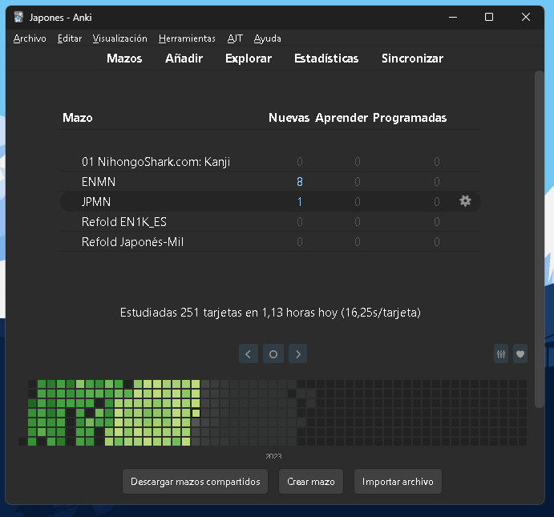

No te preocupes si tu Anki no se parece al que aparece en la imagen en este tutorial te quedara igual.

##  Configurar Anki

Primero configuraremos las preferencias de nuestro Anki, para esto nos dirigimos a `Herramientas>Preferencias...`

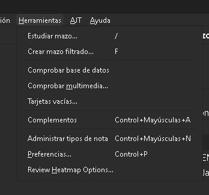

> Te daré mis configuraciones. Estas en la libertad de elegir la que más te apetezca

<table style="width:100%">
    <tr>
        <td>
            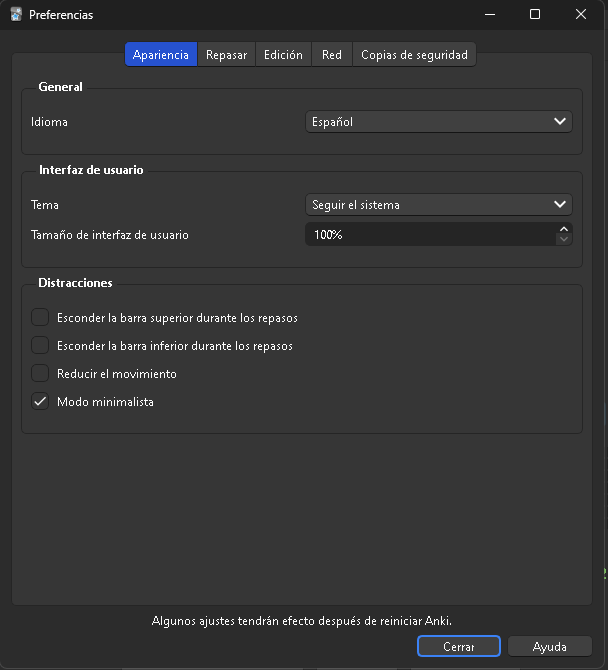 
        </td>
        <td>
            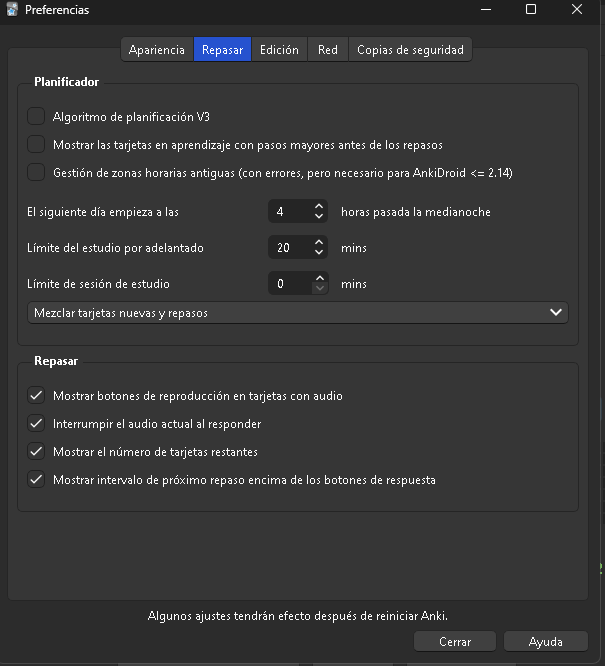
        </td>
    </tr>
    <tr>
        <td>
            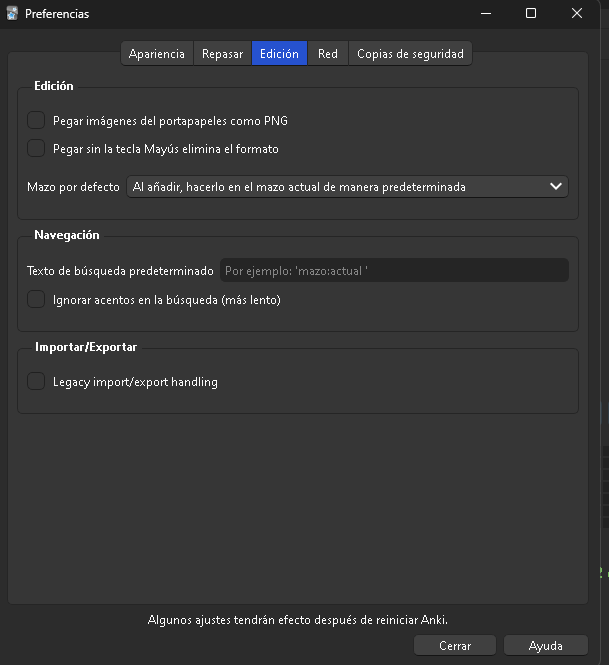
        </td>
    </tr>
</table>

Luego nos dirigimos a `Herramientas>Complementos>Descargar complementos...>Explorar complementos` y nos descargamos los siguientes complementos.

* [AnkiConnect](https://ankiweb.net/shared/info/2055492159): Nos servira para conectarnos a aplicaciones de terceros

* [PassFail2 Remove the Easy and Hard buttons](https://ankiweb.net/shared/info/876946123): Eliminara los botones de facil y dificil

* [Review Heatmap](https://ankiweb.net/shared/info/1771074083): Este es opcional pero es el minimapa que viste en la primera imagen. Solamente nos mostrara estadisticas de nuestro progreso de estudio.

Copiamos el codigo y lo pegamos en Anki.

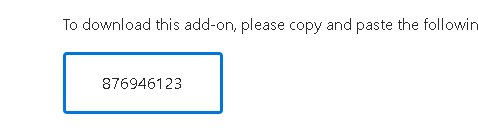
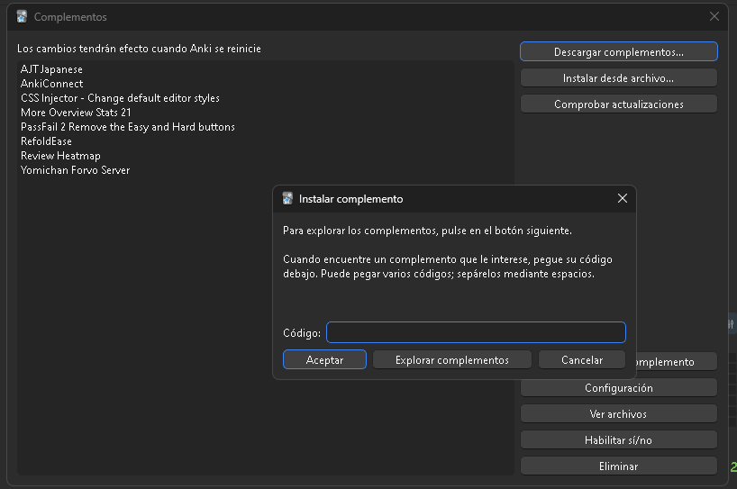

Le damos a *aceptar* y reiniciamos Anki para observar los cambios.

A continuación te descargaras el [Template de Anki](https://drive.google.com/file/d/1MppnKESod2riOUEmxYAwUY5wS-cSKXb_/view?usp=sharing), luego de haber bajado le das `click` y ya lo tendras en Anki. Va aparecer algo como esto:

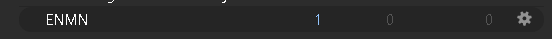
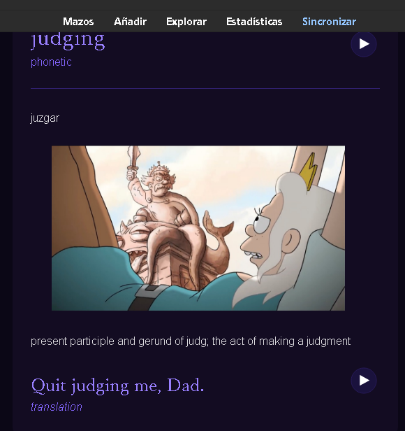

##  Extensiones del navegador

- [Read pronunciation](https://chrome.google.com/webstore/detail/read-pronunciation-englis/ieimachclakgpglmhafclnfklklomfeh)

- [Video Screenshot](https://chrome.google.com/webstore/detail/video-screenshot/ppkojackhibeogijphhfnamhemklmial)

- [Lenguage Reactor](https://chrome.google.com/webstore/detail/language-reactor/hoombieeljmmljlkjmnheibnpciblicm)

## Configurar Read pronunciation

[Video para configurar read pronunciation e integrarlo con anki](https://www.youtube.com/watch?v=dw5rH6IhRpE&t=7s)

Te vas al apartado de extensiones y encuentras read pronunciation te diriges a `more options`

En `The most important Options` seleccionaras el idioma
- English
- French
- English and French

Seleccionaras el idioma a traducir "Spanish"7

## Crear tarjetas Anki

[Video creación tarjetas anki](https://www.youtube.com/watch?v=OzucWUhgL54&t=150s)

## Capturar el audio

Si tienes la curiosidad de capturar el audio uso [ShareX](https://getsharex.com/) y aca te dejo un video de [Matt vs Japan](https://www.youtube.com/watch?v=CfvDKgNUSi8&list=WL&index=7&t=1270s) donde muestra como configurarlo en el minuto `16:56`

## Problemas

### Pantalla negra
 
Si tienes el problema de tu screenshot de Netflix, Disney se queda en negro aqui te dejo algunas soluciones:

- [Solucion 1](https://www.youtube.com/watch?v=ogaVgAL1UcM)

La otra solución es dirigirte a la ubicación del navegador le das click derecho al icono y te vas a `propiedades>Compatibilidad>Cambiar la configuracion para todos los usuarios` y marcas el modo de compatiblidad, aplicas y aceptas. Finalmente reincie tu computadora y ya estara solucionado.

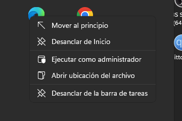
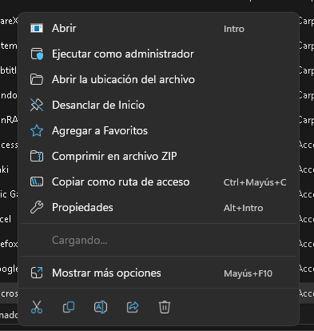
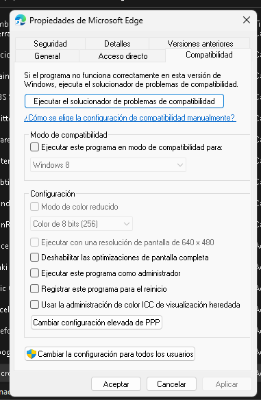
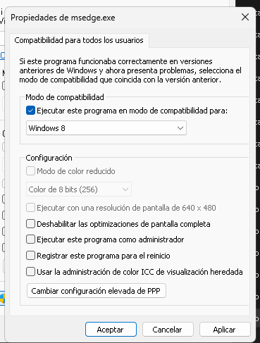
